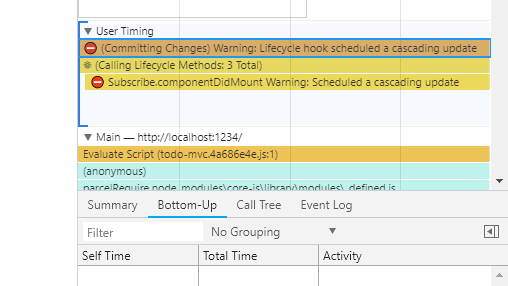

# The problem of Cascading Update

There was a great humor about `Subscribe.componentDidUpdate`:



The fact that there was one line problem in `Subscribe.componentDidMount` that relevants to this problem (but i still keep it for some reasons we will discuss later):

```jsx
  componentDidMount() {
    this.subscription = this.observerListener
      .pipe(
        switchMap(observer => observer),
        distinctUntilChanged()
      )
      .subscribe(this.onStateChange)

    /**
     *  The controversal line i said:
     */
    this.observerListener.next(this.props.observer)
  }
```

If you using `setTimeout` in React Epic:

```jsx
const counterEpic = ({ counter$ }) => {
  setTimeout(() => {
    counter$.next(initialValue)
  }, 0)
  /* ... */
}
```

The result may look okey, except one alternative render in the middle of DOM Content Loaded and Loaded event:


That means if the store state is distinguished from the `initialState` then alternative rendering is required.

The problem is at the time the component is mounted (this is a pure process. the component is rendered and mount first before `componentDidMount` is called) it comes with the `initialState` (for SEO maybe). But if you provide the store with a `BehaviorSubject`. It means that the component will be updated and should be updated with the first value emit from store. Actually the Observable have been made to be hot but we still have to deal with the last item from observer cold stream. (notice that `componentDidUpdate` does not interfere this process. `componentDidMount` is called after the first pure rendering process that causes the problem. `componentDidUpdate` works the same but from second update and so on). The both methods can causes the cascading `setState` problem.

So i tried to add the following lines to `onStateChange`:

```jsx
if (
  /**
   * Because the subscription is distinguished using
   * `distinctUntilChange` so the likely the second condition
   * is only checked on the first rendering.
   */
  childProps === this.state.childProps &&
  /**
   * On the first rendering, if the store state is different from
   * the initialState the user provide so it should be overridden.
   */
  this.state.initialState === childProps
) {
  return
}
```

But the fact is this might never happen, because the `initialState` that you provide to `<Subscribe />` and the `initialState` you provide for the Store are often two different instances (for convenient). So we may need a deep compare check instead. And this addition check only slowing the render process. So i removed the condition check.

The solution to remove the first emit item from store (using `BehaviorSubject`) can be the right solution. That means the first rendering will always display the `initialState` instead of the first state from store. That means you always have to have the `initialState` (this is actually a good choice because it greater support SEO). But it turns out that the `componentDidMount` and cascade `setState` only happens before DOMContentLoaded. So it is okey if you don't use initialState and provide it with default `BehaviorSubject`. But this might lead the misconception of warnings or any potential bug in your app. (`componentDidUpdate` is called in very rare cases when the observer is changed so we only concentrate on the problem with `componentDidMount`). Actually if you disable JS in website so nothing will be displayed. We may need ReactDOMServer and i don't know whether they have some sort of DOMContentLoaded event.

So the rest of this page will only talk about ReactDOM on client and whether we benefit from the first emit value from store or not or do we benefit from the first value emit from store to be run before DOMContentLoaded?

If you benefit from emitting the first value before DOMContentLoaded, it means that cascading update is necessary. If you don't benefit from it so the first value should be emitted after DOMContentLoaded. If you put `counter.next()` into the epic directly, it still result in cascading update. The only way to avoid cascading update is to put it into `setTimeout` function:

```jsx
const counterEpic = ({ counter$ }) => {
  setTimeout(() => {
    counter$.next(initialValue)
  }, 0)
  /* ... */
}
```

This might result in unpleasant so may have to consider a trade off between two solution. However, this only happens on the first rendering process so this won't affect you to profiling the rest of your app. Using `BehaviorSubject` is totally ok. That's why i still keep the controversal line!

To top: [Table of Contents](Wiki.md)
